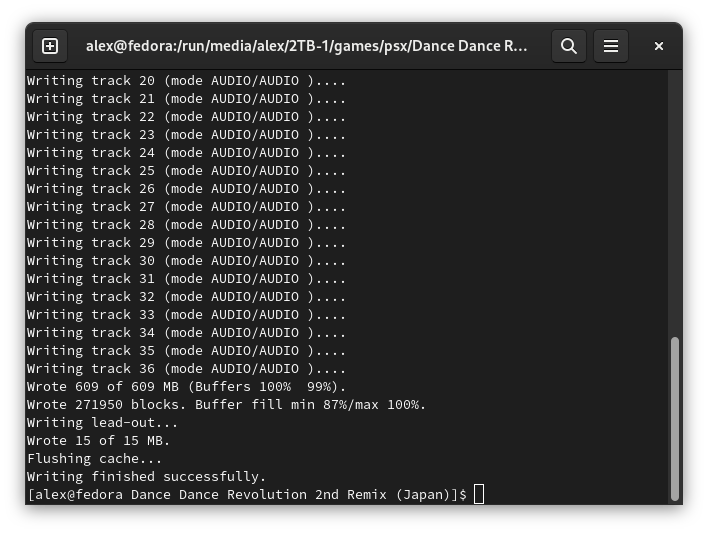

# [The Ultimate Guide To PSX CD-Rs](readme.md) -> [Burning Software](readme.md#burning-software)

## Burning With [CDRDAO](https://cdrdao.sourceforge.net/)

_(Portable [Linux x86_64 build](https://alex-free.github.io/cdrdao).)_

CDRDAO version 1.2.4 and below can not burn EDC Protected PSX games correctly if the game contains CD audio tracks. I have fixed this issue and got my changes into the project. So as of version 1.2.5, cdrdao can now burn EDC Protected PSX games correctly, even those which contain CD audio tracks correctly using the `generic-mmc-raw` driver.

`cdrdao write --speed x --driver generic-mmc-raw --swap -n --eject yourgame.cue`

Breakdown of arguments:

*   `--speed x` argument sets the writing speed. Replace `x` with a number.

*   `--driver generic-mmc-raw` specifies CDRDAO to use the `generic-mmc-raw` driver, which burns the CD image without regenerating the EDC/ECC data written to disc.

*   `--swap` is necessary if the BIN/CUE CD image contains CD audio. Without it, you will get loud static when the CD audio tracks are played as they are by default byte-swapped by CDRDAO if this argument is not specified.

*   `-n` disables the 10 second waiting period before burning.

*   `--eject` will automatically eject the disc immediately after a successful burn.

