# The Ultimate Guide To PSX CD-Rs

_By Alex Free - v1.1.4- 4/25/2024_ 

By using a high quality [CD-R burner](#cd-r-burner), high quality [CD-R Media](#recommended-cd-r-media), [correct burn speed](#burn-speed), and the correct options in [burning software](#burning-software) you will avoid common issues with burned CD-R media on the PSX/PS1, such as:

*   Extremely slow loading times.
*   Game freezes (drive gets load, spins fast, disc stops spinning, because it can't read the disc).
*   FMV playback issues (lags, skips, or cuts out).
*   Audio Playback issues (cuts out or skips).

Inspired by the GBATemp thread [Do modern burners/CD's make lower quality PS1 backups?](https://gbatemp.net/threads/do-modern-burners-cds-make-lower-quality-ps1-backups.628708/), this guide documents all findings on creating the best PSX CD-Rs.

Before continuing, if your drive has issues reading real PSX CD-ROM discs you should really try my [PSX CD drive refurbishment guide](https://alex-free.github.io/unofficial-ps1-cd-drive-service-manual/) first and get that working correctly.

## Table Of Contents:

_CD-R:_

*   [CD-R Composition](#cd-r-composition)
*   [CD-R Capacity](#cd-r-capacity)

_Burner:_

*   [Recommended CD-R Burners](#recommended-cd-r-burners)
*   [Bad CD-R Burners](#bad-cd-r-burners)
*   [Recommended CD-R Media](#recommended-cd-r-media)
*   [Bad CD-R Media](#bad-cd-r-media)

_Ripping & Burning:_

*   [Ripping PSX CDROMs](#ripping-psx-cd-roms)
*   [Burn Speed](#burn-speed)
*   [Burning Software](#burning-software)
*   [CD-R Care](#cd-r-care)

_Playing:_

*   [Console Model](#console-model)
*   [Orientation Trick](#orientation-trick)

##  CD-R Composition

CD-Rs are a bit harder to read compared to CD-ROMs, since they are on average [60-70%](https://www.scientificamerican.com/article/how-do-rewriteable-cds-wo/) as reflective. Some really early CD Audio players and even CD-ROM drives are known to not be able to read CD-Rs. The PSX CD-ROM drive luckily can read CD-Rs. The dev consoles have the same overall CD-ROM drive hardware and Sony officially supported using burning CD-Rs when testing in-production games with these dev consoles, see the old [SCEA BBS archives](https://psx.arthus.net/sdk/Psy-Q/DOCS/BBS/scea_bbs.pdf) from 1995.

The most reflective 80 minute discs still made appear to be the 'Pro'/'Archival Grade' ones, the consumer ones are not on the higher end of the standard CD-R reflectivity. Reflectivity depends on the substrate and dye materials used to manufacture the CD-R, and these are obviously of higher quality for the 'Pro' and 'Archival Grade' media since they cost more and are rated for much longer lifetimes then standard 'consumer grade' media. Consumer grade manufacturing tolerances have seem to have gone out the window lately.

For the CD-R, you want:

* High quality dye (Best to worst for the PSX in this order: Cyanine, Phthalocyanine, AZO, SuperAZO).
* A highly reflective layer system.
* High quality polycarbonate and "sealing" process combining all parts of the CD-R.

CD-RW discs are even less reflective then CD-Rs, at around 25% when compared to CD-ROMs. This is why CD-RWs can not be used on the PSX (without modification to the laser power of the CD-ROM drive, which will cause it to burn out).

### CD-R Capacity

Over the years, CD-Rs have increased in capacity due to consumer demand, until they have [marginally invalidated the Red book physical disc standard](https://en.wikipedia.org/wiki/CD-R). [We have gone from](http://www.osta.org/technology/cdqa7.htm):

*   63minute/550MB
*   71minute/??MB (not sure, very rare).
*   74minute/650MB
*   80minute/700MB (marginal Red Book Standard violation)

There are higher capacities available, but they are completely breaking the Red Book Standard and have zero chance of working with the PSX so ignore them.

The PSX CD-ROM drive hardware has a [seek table](https://problemkaputt.de/psx-spx.htm#cdromresponsetimings) that was designed for 71 minute long discs. This seek table is a hardcoded optimization that is used to specify how the laser is to handle seeking to different parts of the discs. While all PSX CD-ROMs and PSX CD-R Master Discs were made this capacity, unfortunately there are no longer any CD-Rs being manufactured at this specification. Even back in 1995 on the [SCEA BBS archives](https://psx.arthus.net/sdk/Psy-Q/DOCS/BBS/scea_bbs.pdf) Sony did not recommend the then popular 74 minute CD-Rs for working with the dev console hardware. 71 minute media was what was recommended at that time because that is what the console is tuned for:

_From the SCEA BBS (edited formatting):_

`3/29/95 2:34 PM`

`Why 71 minute? Why 900e?`

`BillÊ"Angus" Guschwan`

`CD`

`I had 2 CD questions:` 

`1 - Can we use the CDW950E with the CDGEN software? Why or why not?`

`CD-ROM Generator doesn't support CDW-950E. CDW-950E doesn't have compatibility in SCSI
protocol and doesn't have capability to create master disc.`

`2 - Why do we need to use 71 minute media? Some people like to use the cheaper >74 minute
media. Can you tell me why we need the 71 minute CDRs?`

`The 71min disc is different from 74min at the dencity. PlayStaion is tuned up for 71min and
make reliability for data read. A 74min disc makes error rate more higher`

All these different capacity discs are the same [12CM size](http://www.osta.org/technology/cdqa7.htm) physically, so to increase capacity the spiral windings of the data are packed tighter and tighter. This means that the seek table of the PSX will most likely overshoot and have to compensate (increasing seek time, likelihood of disc read errors, etc.) in finding the sector data it really wants to read if your using a disc with a capacity of higher then 71 minutes. This problem gets exponentially worse as you increase capacity from say 74 minute to 80 minute discs. Looser spiral windings in lower capacity CD-R media also means larger pits and lands which again are easier to read.

63 minute CD-Rs are also extremely rare and expensive. They probably are better then 74 minute ones, but maybe they have the reverse issue with >71 minute media?. 

The best CD-R capacity to use for the PSX is 71 minutes, specifically you want the PSX CD-R Master Disc 71PS. However they now go for over $100 per unit on eBay!

74 minute CD-Rs while somewhat rare and expensive (but not nearly as much as the lower capacities) are still much better then 80 minute media. They can be found as new old stock (and this is the capacity that archival grade media was made in, which is meant to last decades). They are the most obtainable ideal media for the money. Buying any new old stock 74 Minute media from a brand like Verbatim or Taiyo Yuden would however guarantee the quality of the media to be high.

80 minute CD-Rs are the only capacity still made brand new to this day. They are the cheapest and most plentiful option available, although they are also harder to read for the PSX compared to 74 minute discs. The early PS2 console models (pre DVD+R/DVD+RW compatible ones, models SCPH-10000-SCPH-39004) have a more fatal experience with [80 Minute media when it comes to some games](https://github.com/socram8888/tonyhax/issues/24), but luckily this has a  workaround now by patching the CD image before burning it with the [PSX 80 Minute Patcher](https://alex-free.github.io/psx80mp).

Competition is healthy and good for a market. There were once many different competing manufactures of CD-R media, but as of 2023 one single monopoly known as CMC magnetics has [bought out every good manufacturer of CD-R media](https://github.com/alex-free/tonyhax/issues/30). Quality of the 'consumer grade' media has seemed to [gone down due to this](https://gbatemp.net/threads/do-modern-burners-cds-make-lower-quality-ps1-backups.628708/page-3#post-10182249), which is why investing in the 'Pro'/'Archival Grade' CD-R media is important. CMC Magnetics does still use the original equipment and manufacturing proccess of it's acquired brands for the 'Pro'/'Archival Grade' media (which is why the ATIP info still says things like Taiyo Yuden or Verbatim).

## CD-R Burner

The EMF signal strength on burned discs produced by most modern burners is extremely weak (thanks [Ramapcsx2](https://github.com/ramapcsx2) for this info!). This is a key factor in how well the CD-R will work in the PSX. The PSX requires a burned disc with a strong EMF signal. ATAPI/IDE drives pre 2005 are very likely to produce discs with a strong EMF signal.

In a general sense, stay away from CD burners that:

* Are found in laptops.
* Are modern portable USB units without external wall power being required.
* Use SATA instead of ATAPI/IDE.
* Were manufactured in 2005 or later.

These are no hard rules, but rather a general idea for what you should be looking for in a burner. There will be exceptions to the above, but it's a great place to start your journey.

## Recommended CD-R Burners

| Model  | Tester |
| --------------- | ------------- |
| HL-DT-ST GU90n  | Kamil (psxdev discord)|
| IHAS124B Lite On | [wolffangalchemist](https://gbatemp.net/threads/do-modern-burners-cds-make-lower-quality-ps1-backups.628708/page-7#post-10369990) |
| IHas124Y Lite On | [SquidDude](https://gbatemp.net/threads/do-modern-burners-cds-make-lower-quality-ps1-backups.628708/page-8#post-10401567) |
| NEC ND-3550A | [Fien](https://gbatemp.net/threads/do-modern-burners-cds-make-lower-quality-ps1-backups.628708/page-2#post-10126429)  |
| Plextor PX-708A  | Alex Free  |
| Pioneer DVR-AO4 | [DanHans42](https://github.com/danhans42) |
| Pioneer DVR-107DB | [Fien](https://gbatemp.net/threads/do-modern-burners-cds-make-lower-quality-ps1-backups.628708/page-7#post-10369813)  |
| Plextor PX-760A | [SylverRez](https://gbatemp.net/threads/do-modern-burners-cds-make-lower-quality-ps1-backups.628708/page-4#post-10236072) | 
| TEAC DW-224E-V | [DanHans42](https://github.com/danhans42) |

## Bad CD-R Burners

| Model  | Tester |
| --------------- | ------------- |
| ASUS DRW-24F1ST | [Fien](https://gbatemp.net/threads/do-modern-burners-cds-make-lower-quality-ps1-backups.628708/page-2#post-10126429)  |
| LG GP63EX70 | Alex Free |
 Philips RWDV3210 | [Fien](https://gbatemp.net/threads/do-modern-burners-cds-make-lower-quality-ps1-backups.628708/page-7#post-10380318)
| Plextor PX-891SAF | [Ramapcsx2](https://github.com/ramapcsx2) |
| Sony AW-Q160S | [Fien](https://gbatemp.net/threads/do-modern-burners-cds-make-lower-quality-ps1-backups.628708/page-7#post-10367903) | 
| Sony-Optiarc AD-7280S | [Fien](https://gbatemp.net/threads/do-modern-burners-cds-make-lower-quality-ps1-backups.628708/page-7#post-10367903) | 
| TS-H492C | [Fien](https://gbatemp.net/threads/do-modern-burners-cds-make-lower-quality-ps1-backups.628708/page-2#post-10126429)  |

## Recommended CD-R Media

So with all of these factors in regards to the CD-R media itself, I have come up with a list of discs I can recommend to be used with the PSX as they are all use high quality (and reflective) dyes, substrates, and are meant to either last a long time and or provide professional performance and high compatibility with legacy CD-ROM drives:

--------
_Tier 1_

1) [PlayStation Master Disc 71PS CD-R (71 Minutes)](#playstation-master-disc-71ps-cd-r-71-minutes) - the best, the standard, the correct density.

2) [Taiyo Yuden That's CD-R CDR-74ZY (74 Minutes)](#taiyo-yuden-thats-cd-r-cdr-74zy-74-minutes) - the retail twin to the above, in a standard 74 minute density.

--------
_Tier 2_

3) [TDK Data CD-R For Computer Writers (74 Minutes)](#tdk-data-cd-r-for-computer-writers-74-minutes) - had good results, and can be found cheap in bulk new-old stock listings.

4) [Verbatim DataLifePlus (74 Minutes)](#verbatim-datalifeplus-74-minutes) - a bit expensive, but these are what originally gave Verbatim an excellent reputation.

5) [CMC Pro Powered By Taiyo Yuden Technology (80 Minutes)](#cmc-pro-powered-by-taiyo-yuden-technology-80-minutes) - very similar in disc composition and ATIP info to tier 1 CD-Rs, only difference is an 80 minute capacity. **The only reason this is not tier 1 is because it is 80 minutes in density**. Hands down **the best 80 minute CD-R still made brand new**.

--------
_Tier 3_

6) [Verbatim DataLifePlus (80 Minutes)](#verbatim-datalifeplus-80-minutes) - uses a newer SuperAZO dye to enable burning at speeds above 8x, which some burners require. Not as good as the original AZO dye formulation, but works well enough and are still made brand new.

7) [Verbatim UltraLifePlus (80 Minutes)](#verbatim-ultralifeplus-80-minutes) - work as well as the above, another good option.

### PlayStation Master Disc 71PS CD-R (71 Minutes)

The holly grail. This is the only CD-R recommended by Sony for in-house use during development of PSX games. It also was what needed to be sent to Sony as the final build in order to ship the game and create the PSX CD-ROMs for retail.

Output of [cdrecord](https://cdrtools.sourceforge.net/private/cdrecord.html) `-atip`:

    ATIP info from disk:
    Indicated writing power: 4
    Is not unrestricted
    Is not erasable
    ATIP start of lead in: -11849 (97:24/01)
    ATIP start of lead out: 319725 (71:05/00)
    Disk type: Long strategy type (Cyanine, AZO or similar)
    Manuf. index: 25
    Manufacturer: Taiyo Yuden Company Limited

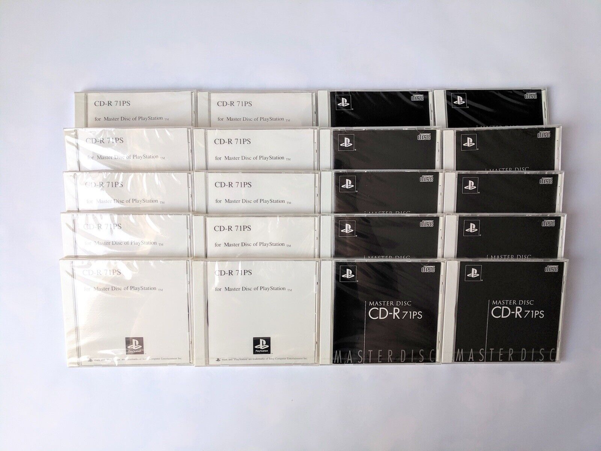

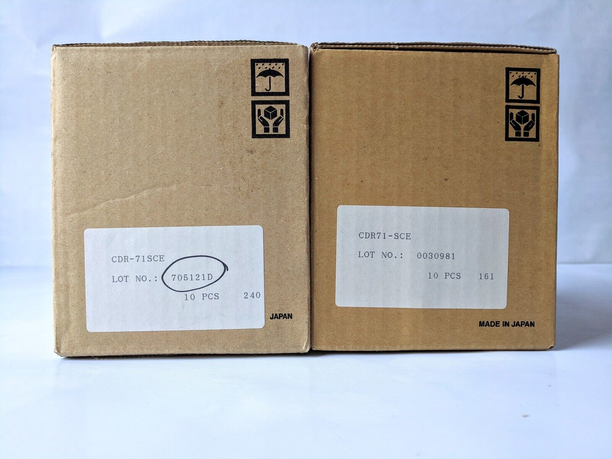

### Taiyo Yuden That's CD-R CDR-74ZY (74 Minutes)

These are almost the same thing as the PlayStation Master Disc 71PS CD-R, but they are 74 minutes in length instead of 71. They also include a `Disc sub type` in the ATIP.

Output of [cdrecord](https://cdrtools.sourceforge.net/private/cdrecord.html) `-atip`:

    ATIP info from disk:
      Indicated writing power: 4
      Is not unrestricted
      Is not erasable
      Disk sub type: Medium Type A, high Beta category (A+) (3)
      ATIP start of lead in:  -11849 (97:24/01)
      ATIP start of lead out: 336075 (74:43/00)
    Disk type:    Long strategy type (Cyanine, AZO or similar)
    Manuf. index: 25
    Manufacturer: Taiyo Yuden Company Limited
 
### TDK Data CD-R For Computer Writers (74 Minutes)

These work great, and are pretty cheap for 74 minute media if you can find them on eBay.

Output of [cdrecord](https://cdrtools.sourceforge.net/private/cdrecord.html) `-atip`:

    ATIP info from disk:
      Indicated writing power: 5
      Is not unrestricted
      Is not erasable
      Disk sub type: Medium Type A, high Beta category (A+) (3)
      ATIP start of lead in:  -11324 (97:31/01)
      ATIP start of lead out: 336225 (74:45/00)
    Disk type:    Long strategy type (Cyanine, AZO or similar)
    Manuf. index: 22
    Manufacturer: Ritek Co.

### Verbatim DataLifePlus (74 Minutes)

I've used them in the past and they work quite well. Huge thanks to [akikokumagara](https://gbatemp.net/members/akikokumagara.410237/) for [these pictures](https://gbatemp.net/threads/do-modern-burners-cds-make-lower-quality-ps1-backups.628708/page-3#post-10223678) since I don't have any around at the moment myself.

Output of [cdrecord](https://cdrtools.sourceforge.net/private/cdrecord.html) `-atip`:

    ATIP info from disk:
      Indicated writing power: 5
    Disk Is not unrestricted
    Disk Is not erasable
      ATIP start of lead in:  -11080 (97:34/20)
      ATIP start of lead out: 335100 (74:30/00)
    Disk type:    Long strategy type (Cyanine, AZO or similar)
    Manuf. index: 11
    Manufacturer: Mitsubishi Chemical Corporation

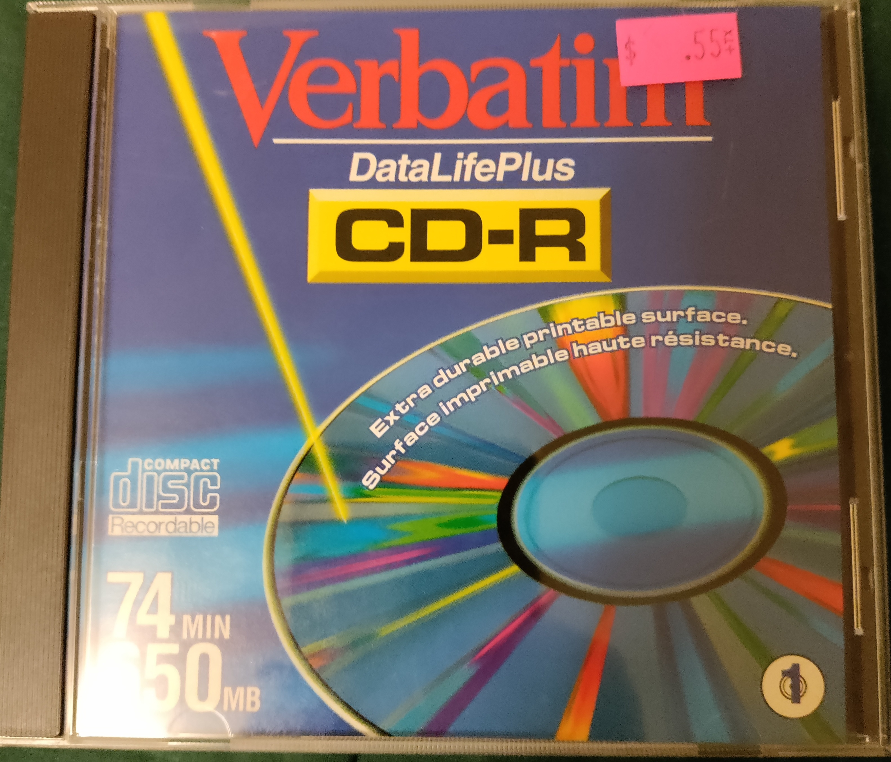

The bottom right of the back cover for these discs has the **copyright date of 1997 or 1999**:

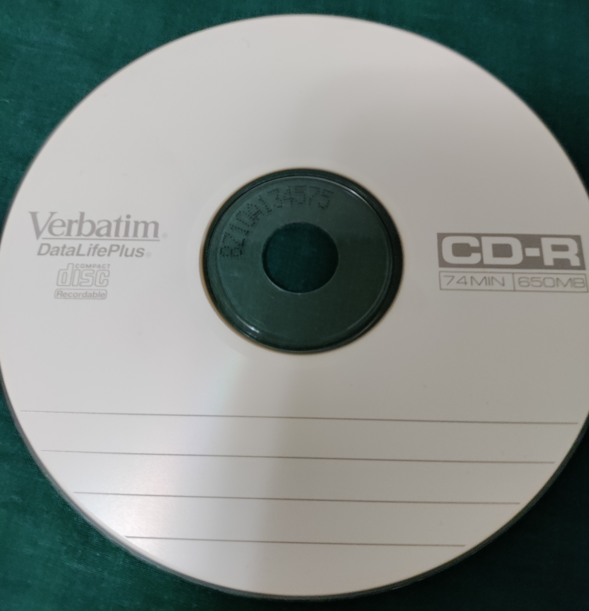

Notice the super deep blue AZO dye. This is the original formulation, it was changed at some point to a lighter blue to increase the burn speed support from 8x to higher. **These discs will fail to burn at any higher speed then 8x**.

### CMC Pro Powered By Taiyo Yuden Technology (80 Minutes)

These are something like the grandchild of the 'That's CD-R!' by Taiyo Yuden from the 90s, which was the basis for the PS1 Master Disc 71PS. They work really well and are cheaper then any of the Verbatim discs. Probably the best 80 minute discs you can buy brand new.

Output of [cdrecord](https://cdrtools.sourceforge.net/private/cdrecord.html) `-atip`:

    ATIP info from disk:
      Indicated writing power: 4
    Disk Is not unrestricted
    Disk Is not erasable
      Disk sub type: Medium Type A, high Beta category (A+) (3)
      ATIP start of lead in:  -11849 (97:24/01)
      ATIP start of lead out: 359847 (79:59/72)
    Disk type:    Long strategy type (Cyanine, AZO or similar)
    Manuf. index: 25
    Manufacturer: Taiyo Yuden Company Limited

### Verbatim DataLifePlus (80 Minutes)

These have the newer Super AZO dye formulation that allows for burning at higher then 8x speed. Not quite as good as the [Verbatim DataLifePlus 74 Minute Discs](#verbatim-datalifeplus-80-minute), or as good as the [CMC Pro 80 Minute Discs](#cmc-pro-powered-by-taiyo-yuden-technology-80-minute)

Output of [cdrecord](https://cdrtools.sourceforge.net/private/cdrecord.html) `-atip`:

    ATIP info from disk:
      Indicated writing power: 4
    Disk Is not unrestricted
    Disk Is not erasable
      Disk sub type: Medium Type A, high Beta category (A+) (3)
      ATIP start of lead in:  -11077 (97:34/23)
      ATIP start of lead out: 359848 (79:59/73)
    Disk type:    Long strategy type (Cyanine, AZO or similar)
    Manuf. index: 11
    Manufacturer: Mitsubishi Chemical Corporation

### Verbatim UltraLifePlus (80 Minutes)

The gold reflective layer makes these very reflective. They work about as well as the [Verbatim DataLifePlus 80 Minute Discs](#verbatim-80-minute).

Output of [cdrecord](https://cdrtools.sourceforge.net/private/cdrecord.html) `-atip`:

    ATIP info from disk:
      Indicated writing power: 5
    Disk Is not unrestricted
    Disk Is not erasable
      Disk sub type: Medium Type B, low Beta category (B-) (4)
      ATIP start of lead in:  -12520 (97:15/05)
      ATIP start of lead out: 359849 (79:59/74)
    Disk type:    Short strategy type (Phthalocyanine or similar)
    Manuf. index: 26
    Manufacturer: TDK Corporation

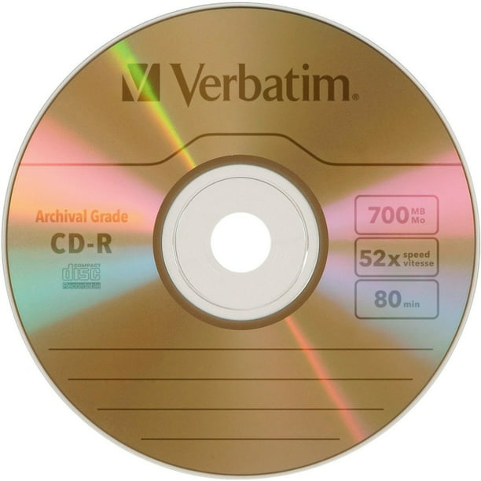

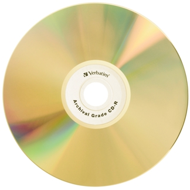

## Bad CD-R Media

These discs should not be used with the PSX as they are extremely cheap, not high quality, and are known to not have good results!

### Maxell CD-R 80 Minute

The 'music' branding is [just a tax](https://en.wikipedia.org/wiki/Private_copying_levy) (that just make these more expensive), all pictures are the same horrible quality media: 

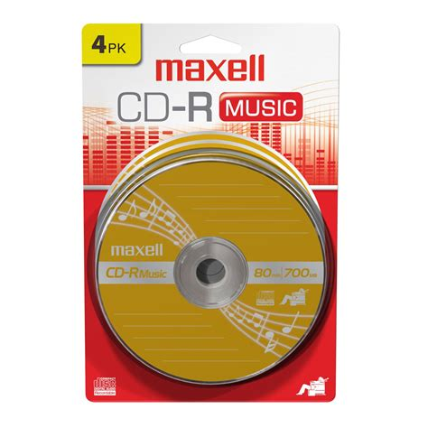

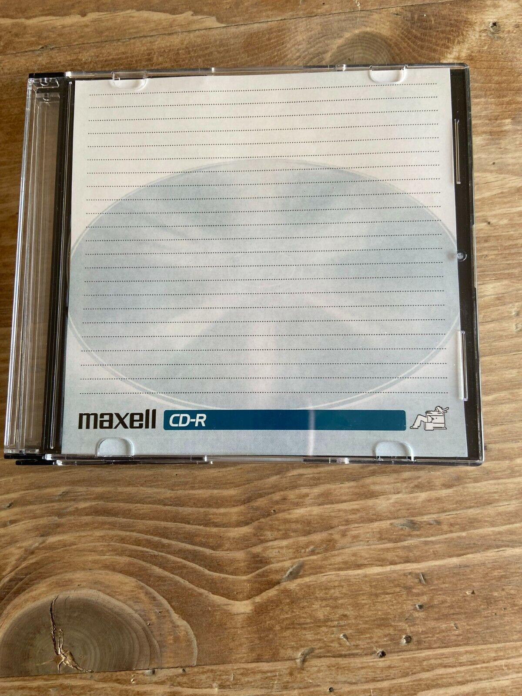

Output of [cdrecord](https://cdrtools.sourceforge.net/private/cdrecord.html) `-atip`:

    ATIP info from disk:
      Indicated writing power: 4
    Disk Is unrestricted
    Disk Is not erasable
      Disk sub type: Medium Type A, low Beta category (A-) (2)
      ATIP start of lead in:  -12508 (97:15/17)
      ATIP start of lead out: 359845 (79:59/70)
    Disk type:    Short strategy type (Phthalocyanine or similar)
    Manuf. index: 22
    Manufacturer: Ritek Co.

### Verbatim 80 Minute

These are what have ruined Verbatim's repution in consumer grade media. The ATIP info confirms that they are made by the CMC Magnetics manufacturing proccess, and not the original Verbatim consumer grade one. Don't get scammed! I call these 'fake Verbatims' and they are only marginally better then the [Maxell 80 Minute CD-Rs](#maxell-cd-r-80-minute).

Just like with the [Maxell 80 Minute CD-Rs](#maxell-cd-r-80-minute) the 'music' branding is [just a tax](https://en.wikipedia.org/wiki/Private_copying_levy) (that just make these more expensive), all pictures below are the same horrible quality media. 

Note: I don't have any of these at the moment to show the ATIP info.

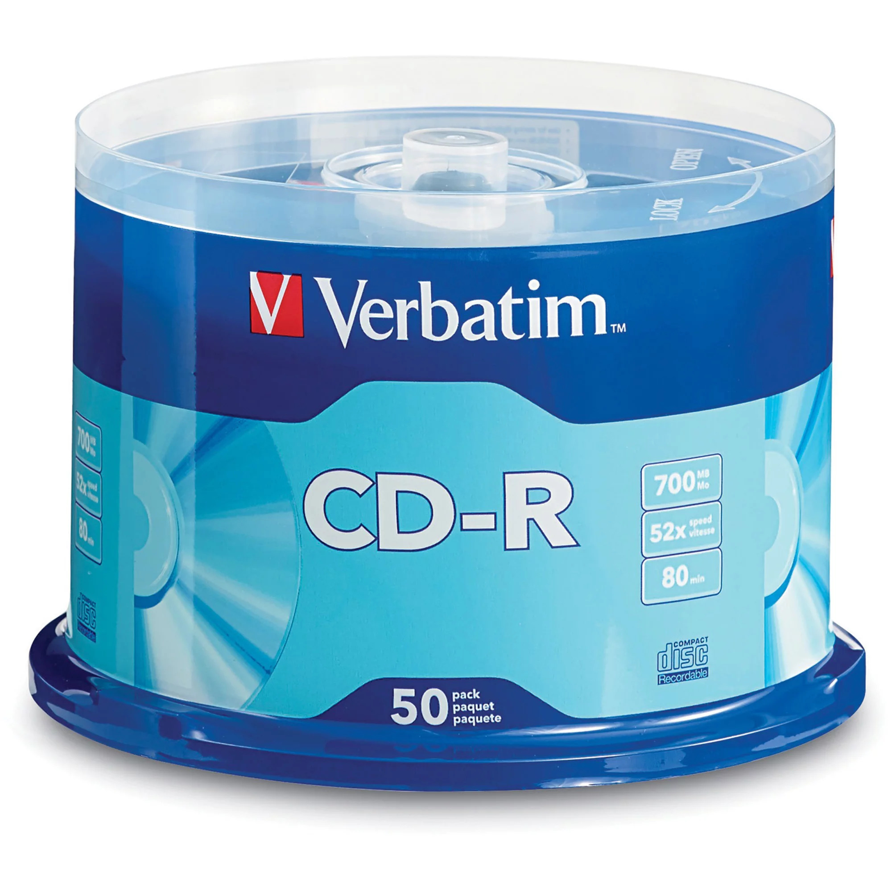

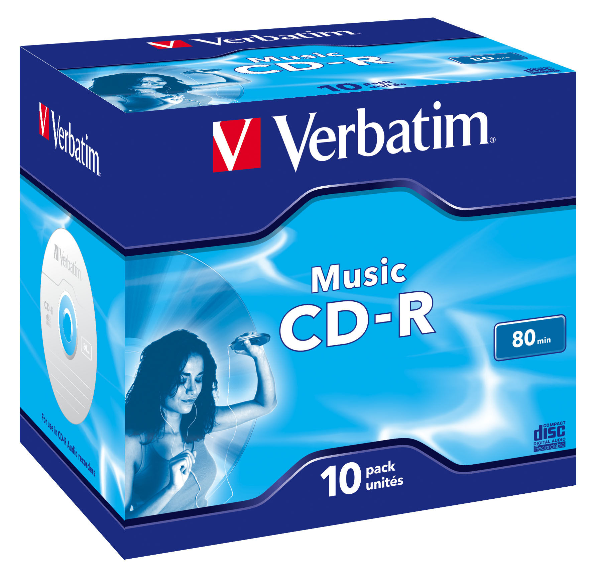

## Ripping PSX CD-ROMs

The below instructions cover ripping the entire PSX library successfully, including games which utilize EDC/EEC protection. 

LibCrypt protected games can simply be ripped by any standard CD burning software and then patched using my [LibCrypt Patcher](https://alex-free.github.io/libcrypt-patcher). The below instuctions do not 'preserve' the protection in any way since it is unnecessary with said patcher being available.

### Ripping With [CDRDAO](https://cdrdao.sourceforge.net/)

_(portable [Linux x86_64 build](https://alex-free.github.io/cdrdao).)_

CDRDAO by default will rip a CD to it's own native BIN/TOC format, this can be done with the command below.

`cdrdao read-cd --read-raw --read-subchan rw_raw --driver generic-mmc-raw yourgame.toc`

**NOTE:** The above command must be run immediately after inserting the CD that you are ripping into your drive, **before it is mounted** by the computer OS. Otherwise, you will run into 'device busy' errors as CDRDAO can not access the CD while your OS has it mounted.

Next use the `toc2cue` program included in CDRDAO to then convert this image to a proper BIN/CUE format (with audio tracks in the correct byte order and SubChannel data removed) that can then be used by other burning programs using this command:

`toc2cue -C yourgame.bin -s yourgame.toc yourgame.cue`

This will output 2 new files, `yourgame.bin` and `yourgame.cue`. These 2 files can be burned like any other BIN/CUE CD image, either by CDRDAO or another program. The other file pair: `yourgame.toc` and `data.bin` is the BIN/TOC fileset that can only be burned by CDRDAO.

## Burn Speed

CD-Rs have ATIP info that explains to the burner how the disc should be burned (and at what speed they can be successfully burned). Each different CD-R media type has a unique dye/substrate/manufacturing process combination and an optimal way to be burned, which even varies with burn speed. This is known as a ['strategy'](https://www.tapeheads.net/threads/cdr-is-speed-all.33741/). Modern CD burners have less 'strategies' in their firmware because it is 'good enough for most cases' to use a generic strategy that mostly works for modern writers, media, and readers (and it saves on flash storage space in the CD burner firmware). Key words, 'mostly works for modern readers', which the PSX certainly is not. The PSX came out in 1994, **before consumer grade CD-R burners were even available for [under $1000](https://web.archive.org/web/20030202233907/http://www.roxio.com/en/support/cdr/historycdr.html)**.

There isn't a best answer to what burn speed you should use with your specific CD-R burner and media. You really need to do some trial and error tests to find what works best for your burner and media combination. Almost all modern (brand new as of 2020) CD burners are incapable of writing at a speed less then 10x, and most can't even do less then 16x. Anything above 24x probably won't work at all. Try 1x,2x,4x,6x,8x,10x, or 16x first.

## Burning Software

While most burning software can burn a majority of PSX disc images just fine, there are some exceptions:

* Some games are testing for intentional invalid EDC/EEC data as an additional anti-piracy measure known as [EDC protection](https://alex-free.github.io/tonyhax-international/anti-piracy-bypass.html#edc). By using specific software with options available specifying to not regenerate the EDC/EEC data written to disc, we can completely get around this protection.

* A more advanced burn detection anti-piracy protection was released exclusively in some PSX games released in the PAL region, known as LibCrypt. That protection can be patched out with my [libCrypt patcher](https://github.com/alex-free/libcrypt-patcher) and then the disc burned will work in all burning software.

### Burning With [CDRecord](https://cdrtools.sourceforge.net/private/cdrecord.html)

_(Portable [Linux x86_64 build](https://alex-free.github.io/cdrtools).)_

`cdrecord -raw16 --speed=x cuefile=yourgame.cue`

Breakdown of arguments:

`-raw16` specifies using the raw 16 writing mode to burn the cd image, which does not regenerate EDC/ECC data before writing to disc.

Note: You can't use the default dao writing mode mode anyways because there is some bug in regards to handling the pre-gap between the data and audio tracks when burning with the latest cdrecord currently anyways.

`--speed=x` specifies the burn speed. Replace `x` with a number.

`cuefile=yourgame.cue` specifies that your using a cue file named `yourgame.cue`. Replace `yourgame.cue` with the game's cue file your burning.

### Burning With [CDRDAO](https://cdrdao.sourceforge.net/)

_(Portable [Linux x86_64 build](https://alex-free.github.io/cdrdao).)_

CDRDAO version 1.2.4 and below can not burn EDC Protected PSX games correctly if the game contains CD audio tracks. I have fixed this issue and got my changes into the project. So as of version 1.2.5, cdrdao can now burn EDC Protected PSX games correctly, even those which contain CD audio tracks correctly using the `generic-mmc-raw` driver.

`cdrdao write --speed x --driver generic-mmc-raw --swap -n --eject yourgame.cue`

Breakdown of arguments:

*   `--speed x` argument sets the writing speed. Replace `x` with a number.

*   `--driver generic-mmc-raw` specifies CDRDAO to use the `generic-mmc-raw` driver, which burns the CD image without regenerating the EDC/ECC data written to disc.

*   `--swap` is necessary if the BIN/CUE CD image contains CD audio. Without it, you will get loud static when the CD audio tracks are played as they are by default byte-swapped by CDRDAO if this argument is not specified.

*   `-n` disables the 10 second waiting period before burning.

*   `--eject` will automatically eject the disc immediately after a successful burn.

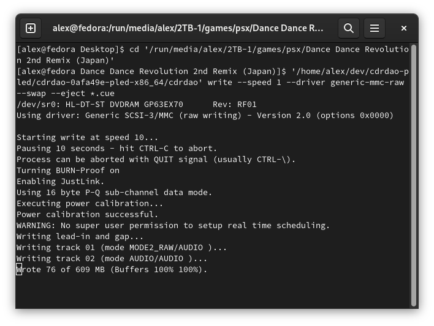

### Burning With [IMGBurn](https://www.imgburn.com/)

IMGBurn (Windows only) does not have an option to disable regeneration of EDC/EEC data, so it can not burn EDC protected games correctly. For games without EDC protection it works fine however.

## CD-R Care

Tips:

* Keep Them Clean. Wiping with a clean high thread count microfiber cloth from the inner ring to the outer edge of the disc in all directions is the proper way to clean CDs.

* Keep Them Out Of The Elements. CD-Rs should be kept sealed in a Jewel case and not left loose (where they will collect dust). They should also be kept out of direct sunlight (in a dark closet or something is best).

* Don't put any sticky labels on them! I'm not sure about writing on discs with a sharpie, so I just invested in a label maker and just put the label on the jewel case for the CD-R and call it a day.

## Console Model

CD-ROM technology was still developing at the time of the PlayStation's initial release in Japan (December 4th 1994). The original model's CDROM controller hardware is quite primitive compared to the last models, and what was found in PS2s. Disc reading tolerances improved greatly throughout the lifespan of the console. It appears to me that these console models have the best disc reading performance and tolerances in roughly these 4 tiers below:

1) SCPH-10000-SCPH-39004 PS2s, SCPH-9XXX PSX, SCPH-7XXX PSX - VC3A or VC3B controllers.

2) SCPH-1XX PSone - theory: made cheaper then any of the above? It is a VC3B or VC3C, but seems a bit less performant to many..

3) SCPH-5XXX - VC2 controller, auto bias/gain software focus, all-digital servo.

4) SCPH-1XXX, SCPH-3XXX - original VC0 or VC1 controller, analog servo, constant, manual hardware bias/gain set by screws on motherboard.

CDROM Controller versions (from [no $ psx-spx](https://psx-spx.consoledev.net/cdromdrive/#19h20h-int3yymmddver)):

      (unknown)        ;DTL-H2000 (with SPC700 instead HC05)
      94h,09h,19h,C0h  ;PSX (PU-7)               19 Sep 1994, version vC0 (a)
      94h,11h,18h,C0h  ;PSX (PU-7)               18 Nov 1994, version vC0 (b)
      94h,11h,28h,01h  ;PSX (DTL-H2000)          28 Nov 1994, version v01 (debug)
      95h,05h,16h,C1h  ;PSX (LATE-PU-8)          16 May 1995, version vC1 (a)
      95h,07h,24h,C1h  ;PSX (LATE-PU-8)          24 Jul 1995, version vC1 (b)
      95h,07h,24h,D1h  ;PSX (LATE-PU-8,debug ver)24 Jul 1995, version vD1 (debug)
      96h,08h,15h,C2h  ;PSX (PU-16, Video CD)    15 Aug 1996, version vC2 (VCD)
      96h,08h,18h,C1h  ;PSX (LATE-PU-8,yaroze)   18 Aug 1996, version vC1 (yaroze)
      96h,09h,12h,C2h  ;PSX (PU-18) (japan)      12 Sep 1996, version vC2 (a.jap)
      97h,01h,10h,C2h  ;PSX (PU-18) (us/eur)     10 Jan 1997, version vC2 (a)
      97h,08h,14h,C2h  ;PSX (PU-20)              14 Aug 1997, version vC2 (b)
      98h,06h,10h,C3h  ;PSX (PU-22)              10 Jun 1998, version vC3 (a)
      99h,02h,01h,C3h  ;PSX/PSone (PU-23, PM-41) 01 Feb 1999, version vC3 (b)
      A1h,03h,06h,C3h  ;PSone/late (PM-41(2))    06 Jun 2001, version vC3 (c)
      (unknown)        ;PS2,   xx xxx xxxx, late PS2 models...?`

**This isn't to say you can't get great CD-R reading performance from all consoles at all**, just that there are better technology/tolerances in different models.

## Orientation Trick

If your console is having issues reading discs, an old trick involves changing the console to a vertical, diagonal, or upside-down orientation while playing the disc. This can sometimes improve the dCD-R disc reading ability of the console. It is recommended to try both left and right orientation changes and different angles in a slight diagonal to figure out the exact best position.

Sometimes the above issue can be alleviated or disappear entirely by following my [psx cdrom refurbishment guide](https://alex-free.github.io/unofficial-ps1-cd-drive-service-manual/).