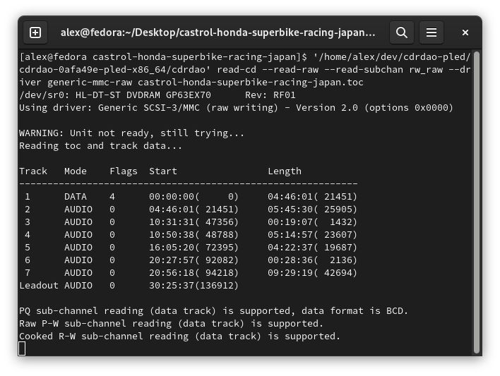
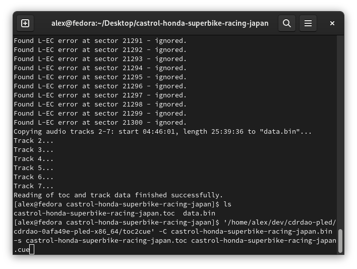
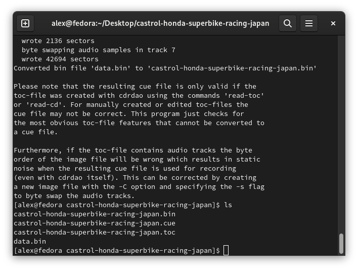

# [The Ultimate Guide To PSX CD-Rs](readme.md) -> [Ripping PSX CDROMs](readme.md#ripping-psx-cdroms)

## Ripping With [CDRDAO](https://cdrdao.sourceforge.net/)

_(portable [Linux x86_64 build](https://alex-free.github.io/cdrdao).)_

CDRDAO by default will rip a CD to it's own native BIN/TOC format, this can be done with the command below.

`cdrdao read-cd --read-raw --read-subchan rw_raw --driver generic-mmc-raw yourgame.toc`

**NOTE:** The above command must be run immediately after inserting the CD that you are ripping into your drive, **before it is mounted** by the computer OS. Otherwise, you will run into 'device busy' errors as CDRDAO can not access the CD while your OS has it mounted.

Next use the `toc2cue` program included in CDRDAO to then convert this image to a proper BIN/CUE format (with audio tracks in the correct byte order and SubChannel data removed) that can then be used by other burning programs using this command:

`toc2cue -C yourgame.bin -s yourgame.toc yourgame.cue`

This will output 2 new files, `yourgame.bin` and `yourgame.cue`. These 2 files can be burned like any other BIN/CUE CD image, either by CDRDAO or another program. The other file pair: `yourgame.toc` and `data.bin` is the BIN/TOC fileset that can only be burned by CDRDAO.

